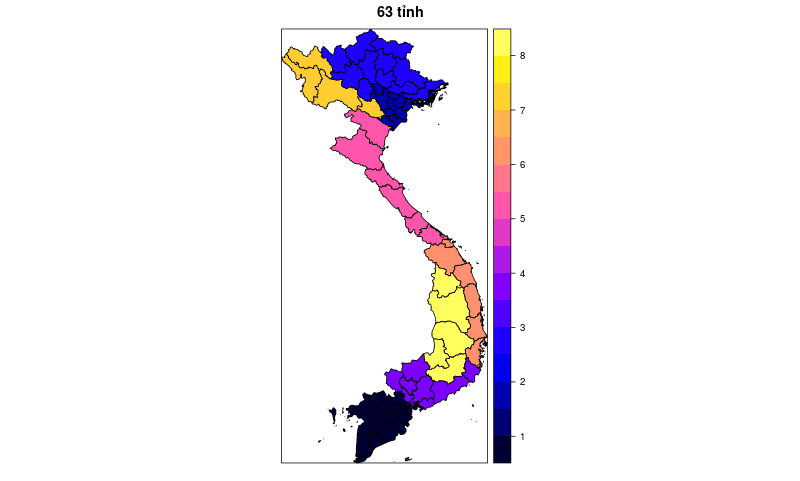

Bản đồ Việt Nam 63 tỉnh trong R
===============================

## Sử dụng:

~~~r
libs <- c("maptools", "sp")
lapply(libs, require, character.only = TRUE)

geo63 <- readRDS("geo63.rds")
spplot(geo63, "ID_1", main="63 tỉnh")
~~~

## Mẫu:

